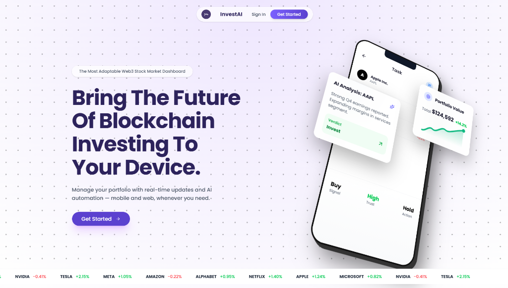

# InvestAI



InvestAI is an autonomous, AI-powered stock market research agent and portfolio dashboard. Built with Next.js and LangGraph, it acts as your personal Wall Street analyst—capable of instantly analyzing financial data, scanning recent news, and delivering highly structured, actionable investment reports in seconds.

## 🚀 Key Features

*   **Autonomous AI Analyst:** Uses LangGraph to orchestrate complex reasoning pipelines. It autonomously fetches real-time financial statements, news, and market data, and uses LLM models to synthesize a final investment verdict (Invest, Watch, or Pass).
*   **Real-Time Market Data:** Integrated directly with Yahoo Finance to pull live charts, historical performance, and company profiles.
*   **Smart Search:** An intelligent search bar that automatically resolves natural language company names into correct, tradable market tickers (filtering out mutual funds and non-equities).
*   **Beautiful UI/UX:** A stunning, modern, minimalistic interface built with Tailwind CSS, Lucide Icons, and Recharts. 
*   **User Portfolios & Watchlists:** Fully persistent data storage using Prisma ORM and Vercel Postgres.

## 🔄 Application Flow

InvestAI is designed to be completely seamless:

1.  **Search & Discovery:** 
    The user enters a company name in the search bar. The internal Search API queries live market data, filters out irrelevant assets (like mutual funds), and resolves the exact market symbol (e.g., typing "Tata" automatically resolves to `TATAMOTORS.NS`).
2.  **Dashboard & Charting:**
    The user is routed to the stock's dashboard. Live pricing and interactive historical trend charts are instantly rendered.
3.  **The AI Research Agent (LangGraph):**
    Clicking "Run AI Analysis" triggers the autonomous agent. 
    *   **Data Intake Node:** Gathers fundamental financials, cash flow, debt, and recent news articles.
    *   **Reasoning Node:** The LLM processes the data, identifying critical green flags, red flags, and formulating an investment thesis.
    *   **Decision Node:** Outputs a deterministic, strictly formatted JSON report containing a confidence score and a final verdict.
4.  **Action:**
    The user reads the AI's thesis and can add the stock to their Watchlist or mock Portfolio, seamlessly saved to the cloud database.

## 🛠️ Tech Stack

*   **Frontend:** Next.js 15 (App Router), React 19, Tailwind CSS
*   **Backend:** Next.js API Routes, Prisma ORM, Vercel Postgres
*   **AI / Agents:** LangGraph, @langchain/google-genai, Gemini 1.5 Pro
*   **Data Provider:** yahoo-finance2
*   **Authentication:** NextAuth.js
*   **Deployment:** Vercel (Serverless Functions & Edge Network)

## 💻 Getting Started (Local Development)

### 1. Clone & Install
```bash
git clone https://github.com/VisheshRaj11/InvestAi.git
cd InvestAi
npm install
```

### 2. Environment Variables
Create a `.env.local` file in the root directory:
```env
# AI Models
GEMINI_API_KEY=your_gemini_api_key

# Authentication
NEXTAUTH_SECRET=your_super_secret_string
NEXTAUTH_URL=http://localhost:3000

# Database (Vercel Postgres)
POSTGRES_URL=your_postgres_connection_string
```

### 3. Sync the Database
```bash
npx prisma db push
```

### 4. Run the Application
```bash
npm run dev
```
Open [http://localhost:3000](http://localhost:3000) in your browser to see the result.

## ☁️ Deployment

This project is perfectly optimized for **Vercel**. 
* The API routes utilize `export const dynamic = "force-dynamic"` to ensure real-time serverless evaluation.
* The `package.json` build script includes `prisma generate` to bypass Vercel's caching mechanisms and ensure the database client is always strictly typed and available at runtime. 
* To deploy, simply link your GitHub repository to Vercel, attach a Vercel Postgres database in the Storage tab, and deploy!
